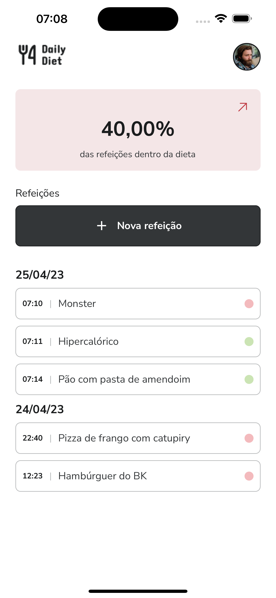
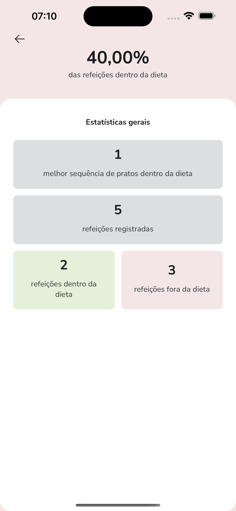
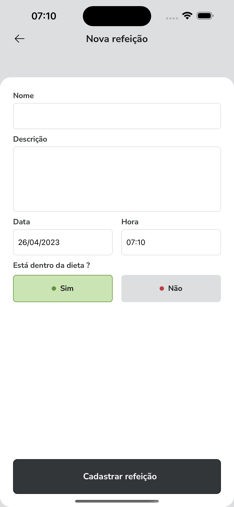
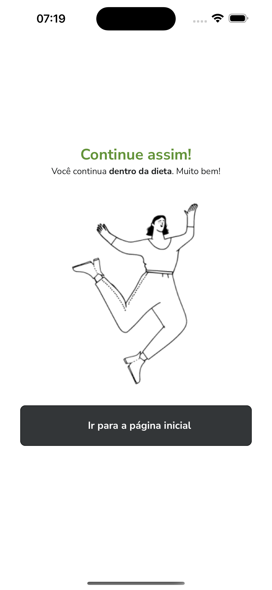
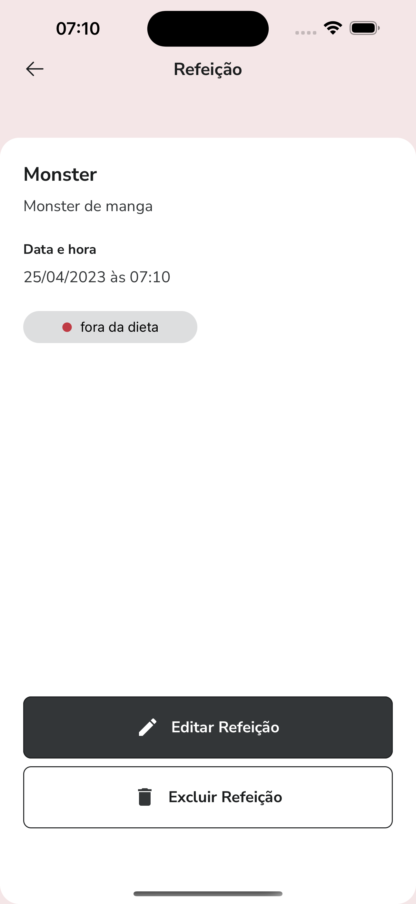
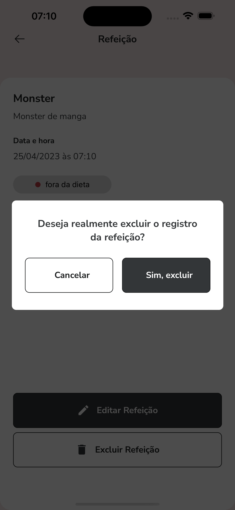

# React Native Diet

<!--


 -->

<p float="left">
  
  
  
  
  
  
</p>

## O Projeto

O objetivo deste projeto é desenvolver um aplicativo de registro diário de alimentação usando a tecnologia React Native, implementando também a biblioteca de estilização Styled Components. Além disso, o projeto inclui a implementação de testes unitários para garantir a qualidade e a eficácia do software.

## Requisitos

[Node.js](https://nodejs.org/en) (versão 16.10 ou superior)

[TypeScript](https://www.typescriptlang.org/) (versão 5 ou superior)

[Expo](https://docs.expo.dev/get-started/installation/) (SDK 48 ou superior)

## Instalação

1. Clone o repositório: `git clone https://github.com/mateuschaves/daily-diet-react-native.git`
2. Instale as dependências: `npm install`

## Uso

Para iniciar o servidor do expo, utilize o seguinte comando:

```bash
    npm run start
```

Para iniciar o aplicativo no emulador pressione `A` no terminal para Android ou `I` para IOS

## Testes

Para executar os testes digite, utilize o seguinte comando:

```bash
    npm run test
```

## Contribuição

1. Faça o fork do projeto
2. Crie sua feature branch (`git checkout -b feature/nome-da-feature`)
3. Commit suas mudanças (`git commit -am 'Adicionando nova feature'`)
4. Faça o push para o branch (`git push origin feature/nome-da-feature`)
5. Crie um novo Pull Request

## Licença

MIT
